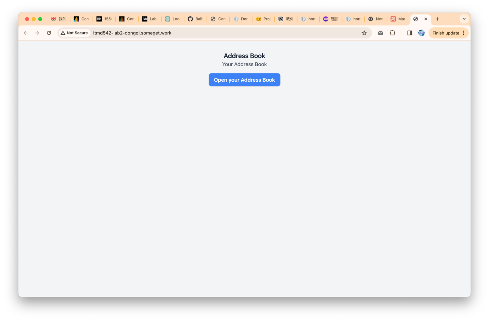
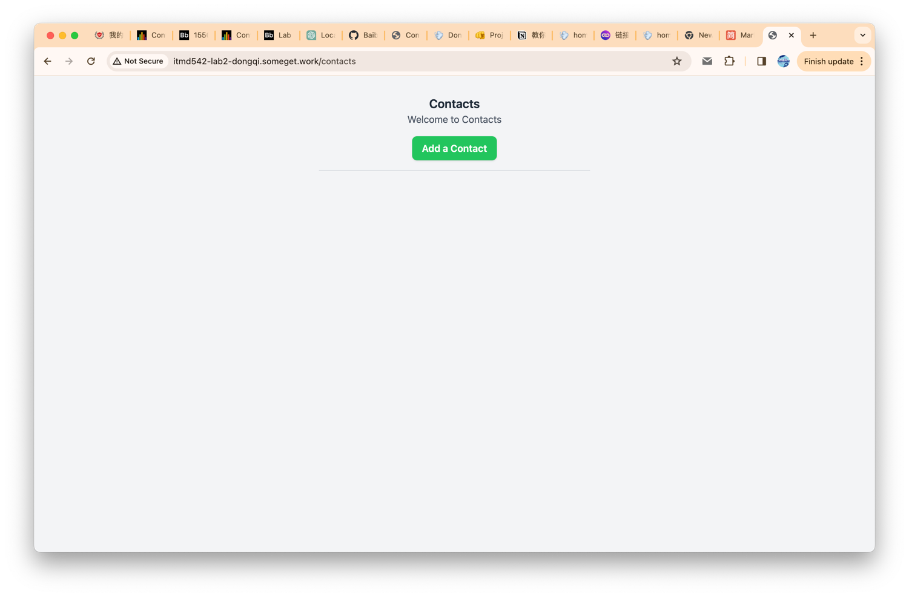
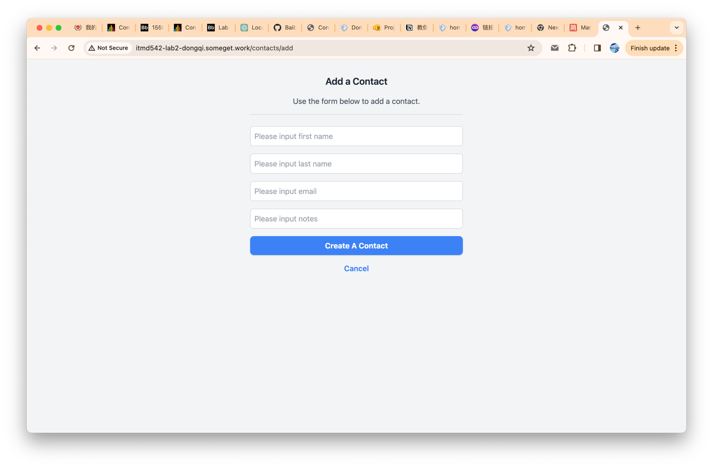
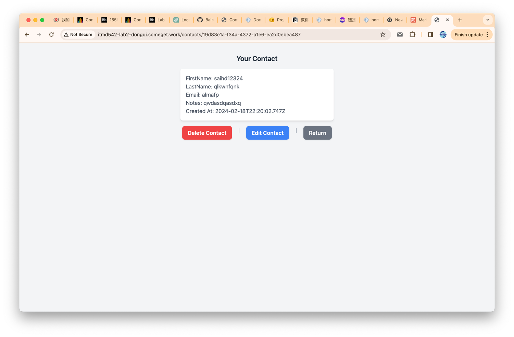

# ITMD-542-Lab2

### Name: Dongqi Bai
### Email: dbai1@hawk.iit.edu
### Class and Assignment numbers: ITMD-542-Lab2
###  Git repository URL: https://github.com/Baibaibaibaibaibaibaibaibai/ITMD542-Lab2.git
## Project Description
### This is an address book where you can add, read, edit, or delete contacts.
#### Development Environment:
##### MacOS: 14.2.1 (23C71)
##### NodeJS Version: v20.10.0
## Installation/Running Instructions:
### How to Run the Project Locally
####This guide will walk you through the process of setting up and running this project on your local machine.

####Prerequisites
#####Before you start, make sure you have Node.js installed on your computer. If you don't have Node.js installed, you can download it from the official Node.js website.

1. Clone the Repository
   First, you need to clone the project repository to your local machine. 
```git clone https://github.com/Baibaibaibaibaibaibaibaibai/ITMD542-Lab2.git```
   
2. Install Dependencies
   Navigate to the project directory and install dependencies
  
   ```cd ITMD542-Lab2```
```npm install```


3. Start the Project
   Start the project with:
      ``` npm run start
      ```


### Online access
http://itmd542-lab2-dongqi.someget.work/
### Insights and Results
#### Homepage:

#### Contacts:

#### Add a contact:

#### Contact Page:


